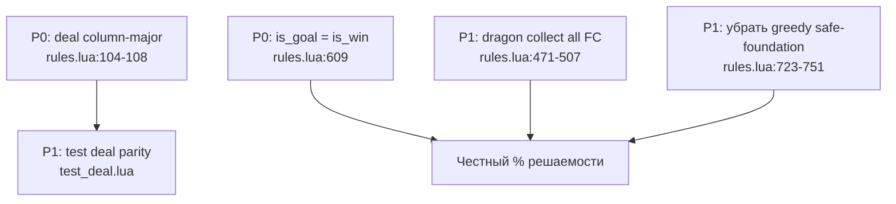

Провожу строгое ревью солвера: сначала читаю `solver/` и соответствующие скрипты игры в `main/Scripts/`.
Читаю игровые скрипты для сравнения с солвером.
# Ревью pure-Lua солвера (`solver/`)

**Вердикт:** ядро правил (стекинг, multi-run, foundation, free cell, `is_win`, B7) в целом совпадает с игрой, тесты **22/22 PASS**. Но **раскладка по seed не совпадает с `main.script`** (37/40 карт при seed=42) — солвер сейчас меряет **другую колоду**. Есть ещё расхождения в dragon collect и цели DFS.

---

## P0 — ломают измерение

### 1. Порядок раздачи: round-robin vs column-major

| | |
|---|---|
| **Файл:строка** | `solver/rules.lua:104-108` vs `main/Scripts/main.script:110-117` |
| **Суть** | Солвер: 5 раундов × 8 колонок (round-robin). Игра: сначала 5 карт в col1, потом col2… (column-major). Shuffle совпадает, **layout — нет** (проверено: 37/40 mismatches для seed=42). |
| **Почему** | SPEC §2.2 описывает round-robin; `deal_cards()` в игре делает иначе. |
| **Фикс** | Заменить цикл раздачи на column-major, как в игре; добавить тест бит-в-бит parity с `deal_cards()`; поправить SPEC §2.2. |

```lua
-- как в main.script:110-117
for col = 1, 8 do
   for _ = 1, 5 do
      table.insert(tableau[col], table.remove(deck))
   end
end
```

### 2. `is_goal()` слабее `is_win()` — риск ложных `solved`

| | |
|---|---|
| **Файл:строка** | `solver/rules.lua:609-618`, `949` |
| **Суть** | Цель DFS: пустой tableau + free cells пусты/заблокированы. **Не** требует `foundation_top==10`×3 и `flower_slot.occupied`. |
| **Почему** | Теоретически возможен «solved» без победы; `run.lua:183` ловит это только на replay. Golden (23 шт.) проходят `is_win`, но контракт solver'а хрупкий. |
| **Фикс** | `is_goal(state) = M.is_win(state)` для полных раздач; для mini-deals — отдельный терминал. |

---

## P1 — правила / поиск

### 3. Dragon collect не убирает всех драконов масти из free cells

| | |
|---|---|
| **Файл:строка** | `solver/rules.lua:471-507` |
| **Суть** | Collect снимает драконов только с **вершин tableau**. При 2 red dragons в FC: после collect один слот blocked, **второй остаётся live** (`dragons_collected.red=true`). |
| **Почему** | Игра (`cursor.script:640-676`) летит **все 4** tracked cards в **один** слот с `complete=true` → blocked. |
| **Фикс** | Перед collect: собрать все `is_dragon && suit==S` из tableau **и** FC; очистить/заблокировать один target slot; остальные FC-слоты с этой мастью — `card=nil`. |

### 4. `compute_dragon_counter` считает драконов в FC

| | |
|---|---|
| **Файл:строка** | `solver/rules.lua:202-207`, `292` |
| **Суть** | Счётчик включает драконов в незаблокированных FC. |
| **Почему** | Игра: `send_counter_to_button` только при экспозиции **вершины tableau** (`tableau_script.script:43-44`). Кнопка — **event counter** (монотонный), не snapshot. |
| **Фикс** | Для parity: моделировать event counter (как `dragon_button.script:24-25`) или считать только tableau tops, как в SPEC §3.4. Добавить тест: 3 на tableau + 1 в FC при `counter<4`. |

### 5. Greedy safe-foundation в `apply_mandatory` ≠ игра

| | |
|---|---|
| **Файл:строка** | `solver/rules.lua:723-751`, `815-843` |
| **Суть** | Солвер **принудительно** уводит «безопасные» карты в foundation до ветвления. |
| **Почему** | Игра в обычном ходе авто-улетает только **2** (`tableau_script.script:40-42`). Safe-predicate — из `plans/auto-finish.md`, не из runtime. |
| **Фикс** | В `apply_mandatory` оставить только `flower_auto`, `2→foundation`, `dragon_collect`. Safe-foundation — опциональный pruning, не mandatory. Иначе **занижение % решаемости**. |

### 6. `test_deal.lua` не ловит расхождение layout

| | |
|---|---|
| **Файл:строка** | `solver/tests/test_deal.lua:5-16` |
| **Суть** | Тест ссылается на `main.script:367-377`, но проверяет только структуру/детерминизм, **не** parity layout с `deal_cards()`. |
| **Фикс** | Golden-вектор: `game_deal(seed)` column-major vs `rules.deal(seed)` для seeds 1, 42, 12345. |

### 7. `dragon_collect` мутирует stale `free_slots_counter`

| | |
|---|---|
| **Файл:строка** | `solver/rules.lua:509-514` |
| **Суть** | Ручной decrement stored counter, тогда как `legal_moves` использует `compute_free_slots_counter()`. |
| **Фикс** | Убрать stored counters из state или всегда пересчитывать derived-поля после каждого хода. |

---

## P2 — качество / метрика / мёртвый код

### 8. Мёртвый код `apply_mandatory` (untracked)

| | |
|---|---|
| **Файл:строка** | `solver/rules.lua:671-757` |
| **Суть** | Не вызывается; `solve` использует только `apply_mandatory_tracked`. Мусор с `\0` placeholder (строка 685). |
| **Фикс** | Удалить. |

### 9. Мёртвый тип `to_empty_tableau`

| | |
|---|---|
| **Файл:строка** | `solver/rules.lua:527-537` (apply), не генерируется в `legal_moves` |
| **Фикс** | Удалить или генерировать в `legal_moves`. |

### 10. Stored `dragon_counter` / `free_slots_counter` в state

| | |
|---|---|
| **Файл:строка** | `solver/rules.lua:121-122`, `175-176` |
| **Суть** | Инициализируются в `deal()`, но не синхронизируются; `legal_moves` всё равно вызывает `compute_*`. |
| **Фикс** | Убрать из state или вычислять при каждом доступе. |

### 11. Комментарий «DFS/IDDFS» — только DFS

| | |
|---|---|
| **Файл:строка** | `solver/rules.lua:603`, `877` |
| **Суть** | IDDFS не реализован. |
| **Фикс** | Поправить комментарий или добавить IDDFS. |

### 12. Node budget → timeout-доминирование

| | |
|---|---|
| **Файл:строка** | `solver/run.lua:31`, `924-927` |
| **Суть** | Budget=15000; seeds 1..5: 60% timeout. «unsolvable» почти не встречается — метрика = «solved в рамках бюджета», не истинная решаемость. |
| **Фикс** | Отчитывать отдельно; поднять budget / pruning для measurement-фазы. |

### 13. Lua 5.4 PRNG ≠ Defold runtime

| | |
|---|---|
| **Файл:строка** | `solver/rules.lua:71`, `main/Scripts/main.script:368` |
| **Суть** | Алгоритм совпадает (20 warmup + 3×FY), но `math.random` может отличаться от Defold LuaJIT. |
| **Фикс** | Один reference seed из live build; или метрика «по распределению», не по конкретным seeds. |

### 14. `can_auto_finish` без `tutorial_mode` / `auto_finishing`

| | |
|---|---|
| **Файл:строка** | `solver/rules.lua:547-576` vs `main/Scripts/main.script:464-466` |
| **Суть** | Солвер не блокирует tutorial/auto_finishing. Для CLI-метрики ОК. |
| **Фикс** | Документировать как measurement-only divergence. |

### 15. Дублирование single/multi ходов

| | |
|---|---|
| **Файл:строка** | `solver/rules.lua:331-396` |
| **Суть** | Верхняя карта валидного run дублируется как `tableau_to_tableau` и как `multi` (run_size=1 исключён, но run_size=2 с тем же top — дубль). |
| **Фикс** | Для поиска допустимо; для чистоты — дедуп по resulting state. |

### 16. `math.randomseed` в `deal()` — глобальное состояние RNG

| | |
|---|---|
| **Файл:строка** | `solver/rules.lua:71` |
| **Фикс** | Локальный PRNG или `math.randomseed` только в CLI. |

---

## Что совпадает с игрой (PASS)

| Область | Источник | Статус |
|---------|----------|--------|
| `can_stack` (разные масти, `bottom==top+1`) | `tableau_script.script:163`, `card.script:49` | OK |
| Multi-run: только maximal valid suffix, не через разрыв (B7) | `tableau_script.script:86-144` | OK |
| Foundation: 2 на пустой, далее same suit +1 | `base_slot.script:13,67-76` | OK |
| Free cell: любая карта in; blocked inaccessible | `free_cell.script:46-51,102-105` | OK |
| `is_win`: 3×10 + flower, не `base_count>=27` | `solver/rules.lua:405-410`, тесты w2/w3 | OK |
| Flower auto с вершины tableau | `tableau_script.script:37-39` | OK |
| Auto 2 только с вершины tableau | `tableau_script.script:40-42` | OK |
| Deck: 27+12+1, порядок сборки | `main.script:62-76` | OK |
| Shuffle: 20 warmup + 3×FY | `main.script:369-377` | OK |
| DFS + transposition + budget | `rules.lua:877-975` | OK (логика sound) |
| Golden replay → `is_win` | 23/23 PASS | OK |

---

## Пробелы в тестах

| Тест | Покрывает | Не покрывает |
|------|-----------|--------------|
| B1-B7 | move parity | deal layout, dragon FC edge cases |
| test_win | `is_win` anti-weakening | — |
| test_deal | структура, RNG determinism | **column-major parity** |
| test_solvable | mini-board 6 карт | `is_win` на полных 40-карточных раздачах |
| — | — | safe-foundation mandatory vs game |
| — | — | dragon collect с 2+ dragons в FC |

---

## Приоритет исправлений



1. **Сначала deal** — без этого все % по seed бессмысленны для live game.
2. **`is_goal = is_win`** — убрать ложные solved на уровне solver, не только replay.
3. **Dragon collect FC** + **убрать mandatory safe-foundation**.
4. **Тест parity раздачи** — регрессия на P0.

---

## Итог

| Критерий | Оценка |
|----------|--------|
| (1) Легальные ходы | **~90%** — core OK, dragon FC/counter — дыры |
| (2) Победа | **`is_win` OK**, `is_goal` — нет |
| (3) DFS/ложные solved | Replay спасает, контракт слабый |
| (4) Детерминизм seed | Shuffle OK, **layout — P0 mismatch** |
| (5) Баги/мёртвый код | 2 мёртвых функции, stale counters |

**Текущие 22 PASS теста не гарантируют parity с игрой** — главный пропуск: порядок раздачи. После фикса deal пересчитать golden и % решаемости.
